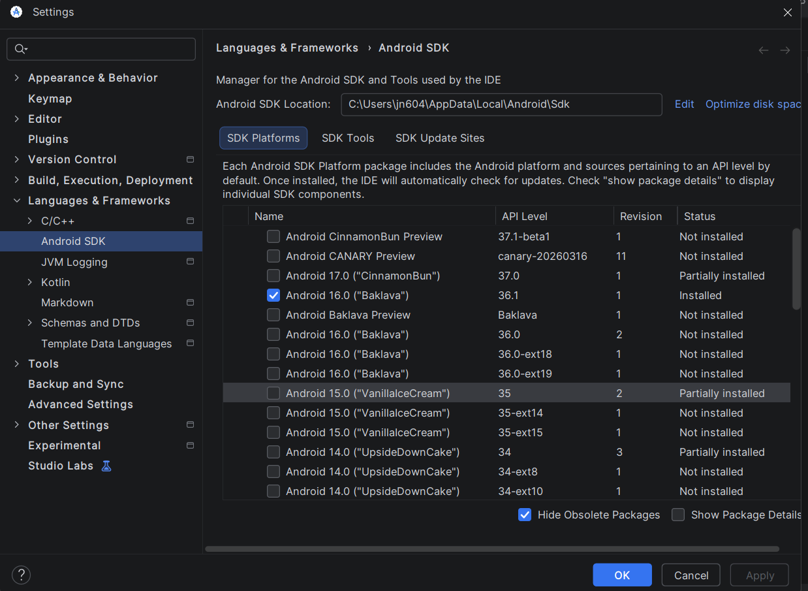
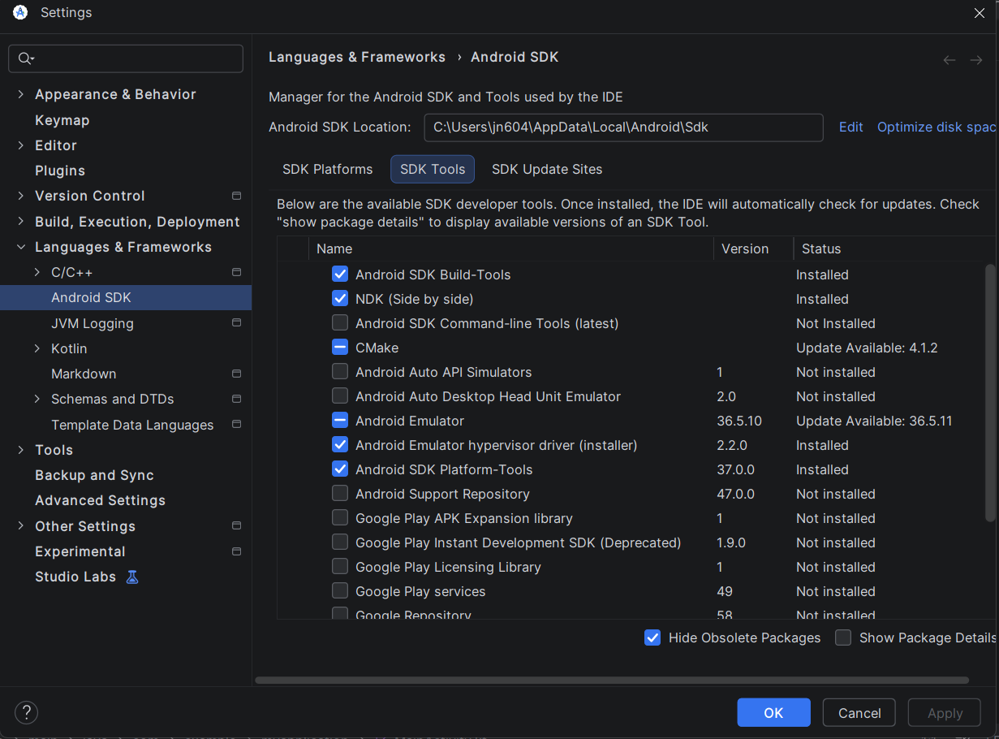

Havee fun with NightmareVision V1! (***[follow me on twitter](https://twitter.com/DuskieWhy)***)


## 🛠️ Credits Mobile Port to...
* FNF BR (LumiCoder)
* StarNovaBR (StarNova)

## 🌟 Special thanks to...

* ShadowMario and Co. for [Psych engine](https://github.com/ShadowMario/FNF-PsychEngine)
* Nebula_Zorua for the [specific Psych fork](https://github.com/nebulazorua/exe-psych-fork) NMV is built off and for the Modchart backend
* Rozebud for the chart editor little buddies ([Check out their engine too](https://github.com/ThatRozebudDude/FPS-Plus-Public))
* Cne crew for camera rotation support ([Check out codename engine](https://github.com/CodenameCrew/CodenameEngine))
* FunkinCrew for their [Lime](https://github.com/FunkinCrew/lime), [Openfl](https://github.com/FunkinCrew/openfl), [Hxcpp](https://github.com/FunkinCrew/hxcpp) forks
* MaybeMaru for [MoonChart](https://github.com/MaybeMaru/moonchart) and [Flixel-Animate](https://github.com/MaybeMaru/flixel-animate)
  
---

## 🛠️ How to compile NMV Engine

### Quick Note
* Haxe 4.3.6 and Haxelib 4.2.0 or newer is expected
* This engine ENFORCES the use of local libraries with hxpkg/hmm to prevent issues in relation to `hxvlc`
* The expected library versions are listed within the .hxpkg file.
* if compilation errors arise, Ensure your Haxe version is correct and your haxelibs match what is listed in the .hxpkg file

## 1. Download the prerequisites
***
**For Both Platforms:**
* [Haxe](https://haxe.org/download/)
* [Git](https://git-scm.com/downloads)
* [Android Studio](https://developer.android.com/studio?hl=pt-br)

**For PC (Windows) Compilation:**
* [VS Community Build Tools](https://aka.ms/vs/17/release/vs_BuildTools.exe)
* within the VS Community Installer, download `Desktop development with c++`

To get the correct SDK and NDK, open **Android Studio** and go to the **SDK Manager** (Settings > Languages & Frameworks > Android SDK).

In the **SDK Platforms** tab, make sure you have a recent Android API version installed to build the app:


Then, switch to the **SDK Tools** tab. Here you must check the boxes for **Android SDK Build-Tools**, **NDK (Side by side)** (you can check "Show Package Details" to select the r21e version), and **Android SDK Platform-Tools**. Click Apply to download them:


---

### 2. Download the projects required libraries
***
#### Recommended Method (Slower)
In a cmd within the project directory, in order run...

```sh
haxelib git hxpkg https://github.com/ADA-Funni/hxpkg add-hmm-compatibility
haxelib run hxpkg install
```

#### Advanced Method (Faster)
> [!IMPORTANT]
> This requires [Rust](https://rust-lang.org/tools/install/) to be installed!

In a cmd within the project directory, in order run...

```sh
haxelib git hxpkg https://github.com/ADA-Funni/hxpkg add-hmm-compatibility
haxelib run hxpkg to-hmm

cargo install --git https://github.com/ninjamuffin99/hmm-rs hmm-rs
hmm-rs clean
hmm-rs install

haxelib fixrepo

haxelib install hmm
haxelib remove grig.audio
haxelib run hmm reinstall grig.audio

haxelib fixrepo
```
---

## 3. Setup Lime & Compile

#### 💻 For Windows (PC)
After that is complete, run `haxelib run lime rebuild cpp -release`

Then, run `haxelib run lime test windows -release` and you should be compiling

If you get errors related to lime, run limeFixer and try again

#### 📱 For Android (Mobile)
First, set up your Android environment by running:
```sh
lime setup android
```

When prompted, provide your exact absolute paths ex:
* **Absolute path to Android SDK:** `C:\Path\to\your\sdk`
* **Absolute path to Android NDK:** `C:\Path\to\your\ndk`
* **Absolute path to Java JDK:** `C:\Path\to\your\jdk`
*(Leave the Apache Ant path blank and press Enter).*

After setting up the paths, run the following command to compile:
```sh
haxelib lime build android -release
```
*(Use `test android` instead if your device is plugged in via USB Debugging and you want it to install automatically).*
